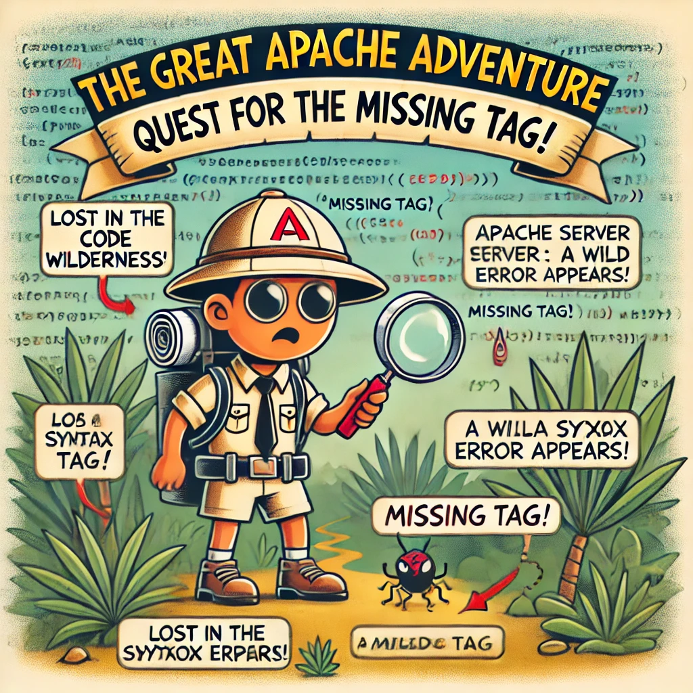

#0x19-postmortem Apache Server not Running

#Issue Summary:
On August 17, 2024, an outage occurred on our Apache server, resulting in downtime from 2:00 PM to 3:30 PM UTC. During this period, 80% of our users were impacted, experiencing significant slowdowns and, in many cases, an inability to access the website. The root cause of the outage was traced back to a misconfiguration in the Apache configuration file, specifically a missing closing tag. This syntax error caused the Apache server to fail during startup, leading to the service interruption.

##Timeline:
2:05 PM: The issue was first detected through an automated monitoring alert, which indicated that the website was unresponsive.
	
2:10 PM: The initial investigation began, focusing on potential network-related issues. Engineers examined the network logs and performance metrics but found no anomalies that could explain the outage.

2:20 PM: The team explored the possibility of a Distributed Denial of Service (DDoS)attack as a potential cause. Traffic patterns were analyzed, and firewall logs were scrutinized, but no signs of malicious activity were found. This investigation path proved to be misleading, consuming valuable time.

2:30 PM: Realizing that the issue was likely internal, the incident was escalated tothe infrastructure team. The team quickly began examining the Apache server itself,including its configuration files and operational status.

3:00 PM: The root cause was identified as a missing closing tag in the Apache configuration file. This syntax error was preventing the Apache server from successfully starting.

3:20 PM: The misconfiguration was corrected by adding the missing tag. The Apache server was then restarted, and service began to be restored.

3:30 PM: Full service was restored, and users were once again able to access the website without issue.

##Root Cause and Resolution:
The root cause of the outage was a simple but critical syntax error in the Apache configuration file. The missing closing tag prevented the Apache server from completing its startup sequence, rendering the web service unavailable. This type of error, while minor in nature, had a significant impact due to the importance of the server'srole in our web infrastructure. Once the syntax error was identified, the issue wasresolved by editing the configuration file to include the missing tag and restarting the Apache server.

##Corrective and Preventative Measures:
To prevent a recurrence of this issue, several corrective and preventative measures will be implemented:
1.	Improve Configuration File Validation Processes: We will introduce a stricter validation process for configuration files before they are applied to production servers. This will involve using automated tools to check for syntax errors and other common issues that could cause server failures.
2.	Implement Automated Configuration Checks: Automated checks will be implemented to validate configuration files before they are committed to the production environment. This includes running a test server with the new configuration to ensure it starts correctly.
3.	Training on Apache Configuration Best Practices: The engineering team will undergo additional training on best practices for Apache configuration management. This will include a focus on common pitfalls and the importance of thorough syntax checking.
4.	Enhanced Monitoring for Server Startup Failures: We will add monitoring that specifically checks for server startup failures. This will allow us to detect similar issues more quickly in the future and reduce downtime.

